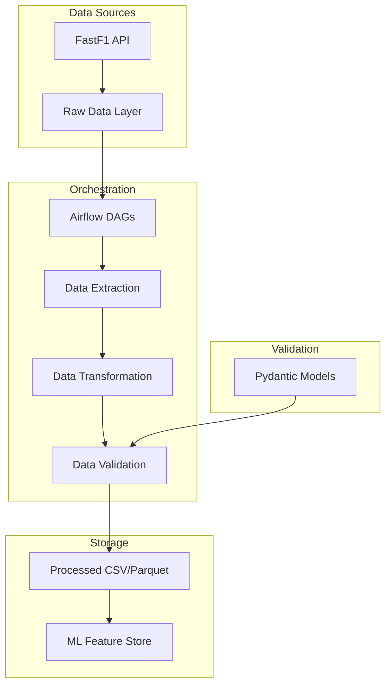
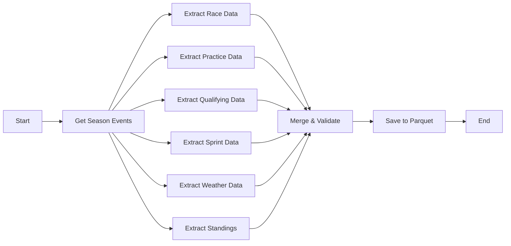

# F1 Data Engineering Project - Implementation Plan

A data engineering pipeline to predict Formula 1 race results using practice sessions, qualifying, weather, and historical performance data.

## Project Overview



---

## Confirmed Decisions

| Decision | Choice | Rationale |
|----------|--------|----------|
| **Weather Data** | FastF1 only | Simpler architecture, sufficient accuracy |
| **Seasons** | 2024-2025 | Sprint format stabilized, cleaner data extraction |
| **Airflow Executor** | LocalExecutor | Simpler setup for development, no Redis needed |

---

## Technology Stack

| Component | Technology | Purpose |
|-----------|------------|---------|
| **Package Manager** | UV | Fast Python dependency management |
| **Data Source** | FastF1 | Official F1 data API |
| **Orchestration** | Apache Airflow | DAG scheduling & monitoring |
| **Validation** | Pydantic | Data schema validation |
| **Containerization** | Docker + Docker Compose | Reproducible environments |
| **Storage** | Parquet/CSV | Efficient columnar storage |

---

## Project Structure

```
formaula_data_engineering/
├── .env.example                    # Environment variables template
├── docker-compose.yml              # Docker services (Airflow + dependencies)
├── Dockerfile                      # Python application container
├── pyproject.toml                  # UV project config
├── uv.lock                         # Dependency lock file
│
├── dags/                           # Airflow DAGs
│   ├── __init__.py
│   ├── f1_data_pipeline.py         # Main extraction DAG
│   └── f1_feature_engineering.py   # Feature transformation DAG
│
├── src/
│   ├── __init__.py
│   ├── extractors/                 # Data extraction modules
│   │   ├── __init__.py
│   │   ├── race_extractor.py       # Race session data
│   │   ├── practice_extractor.py   # Practice session data  
│   │   ├── qualifying_extractor.py # Qualifying data
│   │   ├── sprint_extractor.py     # Sprint session data
│   │   ├── weather_extractor.py    # Weather data
│   │   └── standings_extractor.py  # Championship standings
│   │
│   ├── transformers/               # Data transformation
│   │   ├── __init__.py
│   │   ├── feature_builder.py      # Build ML features
│   │   └── aggregators.py          # Aggregate session data
│   │
│   ├── models/                     # Pydantic schemas
│   │   ├── __init__.py
│   │   ├── session.py              # Session data models
│   │   ├── driver.py               # Driver data models
│   │   ├── weather.py              # Weather data models
│   │   └── race_prediction.py      # Final 26-column schema
│   │
│   ├── loaders/                    # Data persistence
│   │   ├── __init__.py
│   │   └── parquet_loader.py       # Save to parquet/CSV
│   │
│   └── utils/                      # Utilities
│       ├── __init__.py
│       ├── config.py               # Configuration management
│       ├── logging.py              # Logging setup
│       └── storage_io.py           # Storage I/O utilities
│
├── data/                           # Data storage
│   ├── raw/                        # Raw extracted data
│   ├── processed/                  # Transformed data
│   └── cache/                      # FastF1 cache
│
├── tests/                          # Unit & integration tests
│   ├── __init__.py
│   ├── test_extractors.py
│   ├── test_transformers.py
│   └── test_models.py
│
└── docs/
    └── DataSchema.md               # Data schema documentation
```

---

## Phase 1: Project Setup & Infrastructure

### 1.1 Update Dependencies

#### [MODIFY] [pyproject.toml](file:///home/gov03/project/formaula_data_engineering/pyproject.toml)

Add required dependencies:

```toml
[project]
name = "formaula-data-engineering"
version = "0.1.0"
description = "F1 race prediction data pipeline"
readme = "README.md"
requires-python = ">=3.12"
dependencies = [
    "fastf1>=3.7.0",
    "pydantic>=2.10.0",
    "pydantic-settings>=2.6.0",
    "apache-airflow>=2.10.0",
    "pandas>=2.2.0",
    "pyarrow>=18.0.0",
    "python-dotenv>=1.0.0",
    "httpx>=0.27.0",
    "structlog>=24.0.0",
]

[project.optional-dependencies]
dev = [
    "pytest>=8.0.0",
    "pytest-cov>=5.0.0",
    "ruff>=0.8.0",
]
```

---

### 1.2 Docker Configuration

#### [NEW] [Dockerfile](file:///home/gov03/project/formaula_data_engineering/Dockerfile)

Multi-stage build for Python application with UV:

- Base image with UV installation
- Dependencies layer for caching
- Application code layer
- Airflow integration

#### [NEW] [docker-compose.yml](file:///home/gov03/project/formaula_data_engineering/docker-compose.yml)

Services:

- **airflow-webserver**: Airflow UI on port 8080
- **airflow-scheduler**: DAG scheduler
- **airflow-worker**: Task executor
- **postgres**: Airflow metadata database
- **redis**: Celery message broker

#### [NEW] [.env.example](file:///home/gov03/project/formaula_data_engineering/.env.example)

Environment variables:

- `AIRFLOW__CORE__EXECUTOR`
- `AIRFLOW__DATABASE__SQL_ALCHEMY_CONN`
- `FASTF1_CACHE_PATH`
- `DATA_OUTPUT_PATH`

---

## Phase 2: Pydantic Data Models

### 2.1 Core Data Models

#### [NEW] [src/models/session.py](file:///home/gov03/project/formaula_data_engineering/src/models/session.py)

```python
class SessionIdentifier(BaseModel):
    race_id: int
    session_code: str           # e.g., "MEX0103_SPRINT"
    target_session: Literal["Sprint", "Race"]
    is_sprint_weekend: bool
    season: int
    race_num: int
    track_id: str
    total_laps: int
```

#### [NEW] [src/models/driver.py](file:///home/gov03/project/formaula_data_engineering/src/models/driver.py)

```python
class DriverData(BaseModel):
    driver_tla: str             # VER, HAM, NOR
    driver_id: str              # Unique driver identifier
    team_id: str                # Unique team identifier
    fp_best_time: float | None
    fp_position: int | None
    quali_pos: int
    quali_best_time: float
    quali_gap_pole: float
    starting_grid: int
    sprint_result: int | None   # NULL if target is Sprint
    sprint_points: int | None
    championship_pos: int
    championship_points: int
    last_3_avg_position: float
```

#### [NEW] [src/models/weather.py](file:///home/gov03/project/formaula_data_engineering/src/models/weather.py)

```python
class WeatherData(BaseModel):
    air_temp: float
    track_temp: float
    humidity: float
    rainfall: float
```

#### [NEW] [src/models/race_prediction.py](file:///home/gov03/project/formaula_data_engineering/src/models/race_prediction.py)

Combined 26-column schema as defined in DataSchema.md:

```python
class RacePredictionRow(BaseModel):
    """Complete row for ML training - 26 columns"""
    # Session identifiers (8)
    race_id: int
    session_code: str
    target_session: Literal["Sprint", "Race"]
    is_sprint_weekend: bool
    season: int
    race_num: int
    track_id: str
    total_laps: int
    
    # Driver/Team (3)
    driver_tla: str
    driver_id: str
    team_id: str
    
    # Practice (2)
    fp_best_time: float | None
    fp_position: int | None
    
    # Qualifying (3)
    quali_pos: int
    quali_best_time: float
    quali_gap_pole: float
    
    # Starting grid (1)
    starting_grid: int
    
    # Sprint (2)
    sprint_result: int | None
    sprint_points: int | None
    
    # Weather (4)
    air_temp: float
    track_temp: float
    humidity: float
    rainfall: float
    
    # Championship (2)
    championship_pos: int
    championship_points: int
    
    # Recent form (1)
    last_3_avg_position: float
    
    # Gap to Winner (1)
    gap_to_winner_sec: float | None
    
    # TARGET (1)
    finishing_position: int
```

---

## Phase 3: Data Extractors

### 3.1 Extractor Modules

#### [NEW] [src/extractors/race_extractor.py](file:///home/gov03/project/formaula_data_engineering/src/extractors/race_extractor.py)

- Extract race results from FastF1
- Get finishing positions for each driver
- Handle DNF/DSQ cases

#### [NEW] [src/extractors/practice_extractor.py](file:///home/gov03/project/formaula_data_engineering/src/extractors/practice_extractor.py)

- Extract FP1/FP3 session data based on weekend type
- Get best lap times and positions
- Sprint weekends: FP1 | Normal weekends: FP3

#### [NEW] [src/extractors/qualifying_extractor.py](file:///home/gov03/project/formaula_data_engineering/src/extractors/qualifying_extractor.py)

- Extract qualifying session times
- Calculate gap to pole
- Handle Q1/Q2/Q3 eliminations

#### [NEW] [src/extractors/sprint_extractor.py](file:///home/gov03/project/formaula_data_engineering/src/extractors/sprint_extractor.py)

- Detect Sprint weekends by checking if 'sprint' is in EventFormat
- Extract **Sprint Qualifying** (Sprint Shootout) results:
  - Position and best time (used instead of standard Qualifying for Sprint Race predictions)
  - Calculate gap to pole (Sprint Qualifying pole)
- Extract **Sprint Race** results:
  - Finishing position and points (8-7-6-5-4-3-2-1 system)

> **Note:** Sprint Qualifying results populate `quali_pos`, `quali_best_time`, `quali_gap_pole` when `target_session == "Sprint"`. Standard Qualifying is used when `target_session == "Race"`.

#### [REFACTOR] [src/extractors/weather_extractor.py](file:///home/gov03/project/formaula_data_engineering/src/extractors/weather_extractor.py)

Refactor existing `get_session_weather()` function from predict.py:

```python
def extract_weather(session: fastf1.Session) -> WeatherData:
    weather_df = session.weather_data
    return WeatherData(
        air_temp=weather_df['AirTemperature'].mean(),
        track_temp=weather_df['TrackTemperature'].mean(),
        humidity=weather_df['Humidity'].mean(),
        rainfall=weather_df['Rainfall'].sum()
    )
```

#### [NEW] [src/extractors/standings_extractor.py](file:///home/gov03/project/formaula_data_engineering/src/extractors/standings_extractor.py)

- Get championship standings before each race
- Calculate last 3 races average position

> [!WARNING]
> **Known Issue**: Need to resolve how to update championship points after sprint race but before main race. Currently, the standings extractor may not correctly reflect points earned during the sprint race when extracting data for the main race.

---

## Phase 4: Airflow DAGs

### 4.1 Pipeline DAGs

#### [NEW] [dags/f1_data_pipeline.py](file:///home/gov03/project/formaula_data_engineering/dags/f1_data_pipeline.py)



DAG Configuration:

- Schedule: Daily at 6 AM UTC
- Catchup: True (for historical data)
- Max active runs: 1
- Task retries: 2

#### [NEW] [dags/f1_feature_engineering.py](file:///home/gov03/project/formaula_data_engineering/dags/f1_feature_engineering.py)

Post-processing DAG for:

- Computing derived features
- Building final 26-column dataset
- Exporting for ML training

---

## Phase 5: Transformers & Loaders

### 5.1 Data Transformation

#### [NEW] [src/transformers/feature_builder.py](file:///home/gov03/project/formaula_data_engineering/src/transformers/feature_builder.py)

- Combine extracted data into unified rows
- Handle sprint vs normal weekend logic
- Apply `starting_grid` rules from schema

#### [NEW] [src/loaders/parquet_loader.py](file:///home/gov03/project/formaula_data_engineering/src/loaders/parquet_loader.py)

- Save validated data to Parquet format
- Partition by season/track for efficient queries
- Support CSV export for debugging

---

## Verification Plan

### Automated Tests

1. **Pydantic Model Tests**

   ```bash
   uv run pytest tests/test_models.py -v
   ```

   - Validate schema constraints
   - Test optional field handling
   - Verify type coercion

2. **Extractor Unit Tests**

   ```bash
   uv run pytest tests/test_extractors.py -v
   ```

   - Mock FastF1 API responses
   - Test error handling for missing data
   - Verify output format matches Pydantic models

3. **Integration Test**

   ```bash
   uv run pytest tests/test_integration.py -v
   ```

   - Extract single race end-to-end
   - Validate output matches DataSchema.md

### Manual Verification

1. **Docker Setup**

   ```bash
   docker compose up -d
   # Access Airflow UI at http://localhost:8080
   # Default credentials: airflow/airflow
   ```

2. **Trigger DAG Run**
   - Navigate to Airflow UI
   - Enable `f1_data_pipeline` DAG
   - Trigger manual run for 2024 season
   - Verify all tasks complete successfully

3. **Validate Output**
   - Check `data/processed/` for Parquet files
   - Load sample and verify 26 columns match schema
   - Spot-check a sprint weekend (e.g., Mexico 2024) for 2 rows per driver

---

## Implementation Order

1. **Phase 1**: Project setup, dependencies, Docker config (~2 hours)
2. **Phase 2**: Pydantic models (~1 hour)
3. **Phase 3**: Data extractors (~3 hours)
4. **Phase 4**: Airflow DAGs (~2 hours)
5. **Phase 5**: Transformers & testing (~2 hours)

**Estimated Total**: ~10 hours

---

## Next Steps

After approval:

1. Set up project structure with `uv init` patterns
2. Implement Pydantic models first (foundation for everything)
3. Build extractors with existing predict.py as reference
4. Create Docker configuration
5. Wire up Airflow DAGs
6. Write tests throughout
